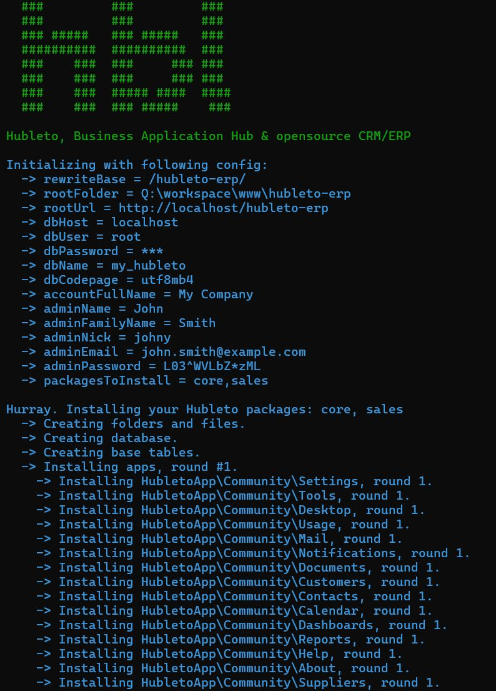

# Hubleto ERP

This is the repository for installation of production-ready Hubleto ERP. To install do following:

  * `cd YOUR_HUBLETO_ERP_FOLDER`
  * `composer create-project hubleto/erp-project . --no-dev`
  * `php hubleto init`

🌟 Enjoy Hubleto and star if you like it!

</img>

## Use Hubleto in your projects

If you want to use Hubleto for your project and **also need to develop your custom apps**, you must tweak a little bit the folder created by `composer create-project`. Follow steps described below.

### Prepare assets

Copy the default assets from `vendor/hubleto/assets` to your project folder:

```
cd YOUR_PROJECT_FOLDER
mkdir assets
cp -r vendor/hubleto/assets/css assets/css
cp -r vendor/hubleto/assets/fonts assets/fonts
cp -r vendor/hubleto/assets/images assets/images
cp -r vendor/hubleto/assets/src assets/src
```

### Compile Javascript and CSS

Install and compile Javascript libraries and CSS files:

```
cd YOUR_PROJECT_FOLDER
npm install
npm run build
```

### Initialize your Hubleto and create first *custom* app

Create first custom app to your project:

```
cd YOUR_PROJECT_FOLDER
php hubleto init
php hubleto create app MyFirstApp
php hubleto create model MyFirstApp MyFirstModel
php hubleto create mvc MyFirstApp MyFirstModel
npm run build-js
npm run build-css
```

### Test your new app

You app should be available in your Hubleto now.

## Contribute to Hubleto core

Contributing to the Hubleto core is the best way how to support us. To do so, **fork all Hubleto repositories** and **recreate the project folder to use these forks**.

### Fork all Hubleto repositories

> **IMPORTANT** Fork all repositories into one folder, e.g. /var/www/hubleto.

  * https://github.com/hubleto/framework
  * https://github.com/hubleto/erp
  * https://github.com/hubleto/react-ui

### Re-create your Hubleto folder

> **IMPORTANT** Change `/var/www/hubleto` in commands below to path to your folder with forks.

```
composer create-project hubleto/erp-project . dev-main
./bin/use-local-repositories /var/www/hubleto
npm run build
php hubleto init
```

## Support us

Hubleto is a community project and so it needs your help. We provide complete Hubleto code for free and maintain its development.

We will be very happy to get in touch with any company or individuals, willing to act as reseller or consultant.

Do not hesitate and contact us via [LinkedIn](https://www.linkedin.com/company/hubleto) or [Reddit](https://www.reddit.com/r/hubleto).

## See also

  * https://github.com/hubleto/erp - the 'main' repository for Hubleto
  * https://developer.hubleto.com - developer guide for Hubleto
  * https://help.hubleto.com - user guide for Hubleto
  * https://www.hubleto.com - a presentation website
  * https://community.hubleto.com - a discussion forum about everything related to Hubleto
  * https://www.hubleto.com/demo - try demo
