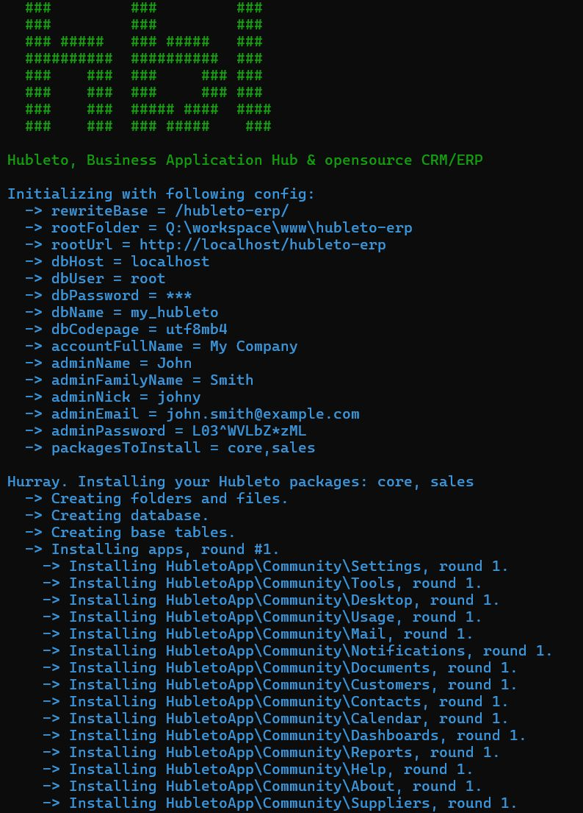

# Hubleto ERP

Production-ready Hubleto ERP. Free to use, ready to be customized.

## Getting started

```
cd YOUR_HUBLETO_ERP_FOLDER
composer create-project hubleto/erp-project . --no-dev
php hubleto init
```

This will install production-ready Hubleto ERP. You may now customize it by developing your Hubleto apps.

🌟 Enjoy Hubleto and star if you like it!

</img>

## Install Hubleto React UI

We recommend you to use free Hubleto React UI library to develop rich data management features into your apps. Read more about [Hubleto's React-based UI library](https://github.com/hubleto/react-ui).

Follow steps described below to install and use Hubleto React UI.

  1. **Prepare assets and compile Javascript + CSS**

      ```
      cd YOUR_PROJECT_FOLDER
      ./bin/prepare-assets.sh
      npm run build
      ```

  2. **Initialize your Hubleto and create first *custom* app**

      ```
      cd YOUR_PROJECT_FOLDER
      php hubleto init
      php hubleto create app MyFirstApp
      php hubleto create model MyFirstApp MyFirstModel
      php hubleto create mvc MyFirstApp MyFirstModel
      npm run build
      ```

  4. **Test your new app**

      Open Hubleto in your browser.

> **TIP FOR ADVANCED DEVELOPERS:** If you want to learn more, check out Hubleto's powerful React-based UI library at https://www.npmjs.com/package/@hubleto/react-ui.

## Support us

Hubleto is a community project and so it needs your help. We provide complete Hubleto code for free and maintain its development.

We will be very happy to get in touch with any company or individuals, willing to act as reseller or consultant.

Do not hesitate and contact us via [LinkedIn](https://www.linkedin.com/company/hubleto) or [Reddit](https://www.reddit.com/r/hubleto).

## See also

  * https://github.com/hubleto/erp - the 'main' repository for Hubleto
  * https://developer.hubleto.eu - developer guide for Hubleto
  * https://help.hubleto.eu - user guide for Hubleto
  * https://www.hubleto.eu - a presentation website
  * https://community.hubleto.eu - a discussion forum about everything related to Hubleto
  * https://www.hubleto.eu/demo - try demo
